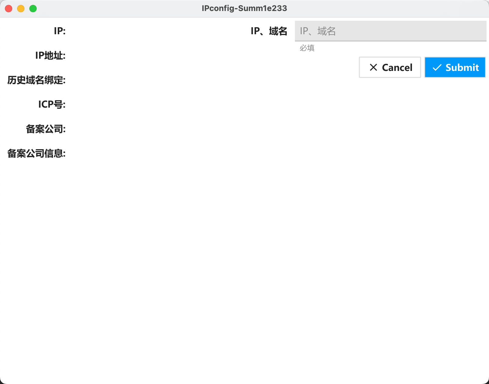
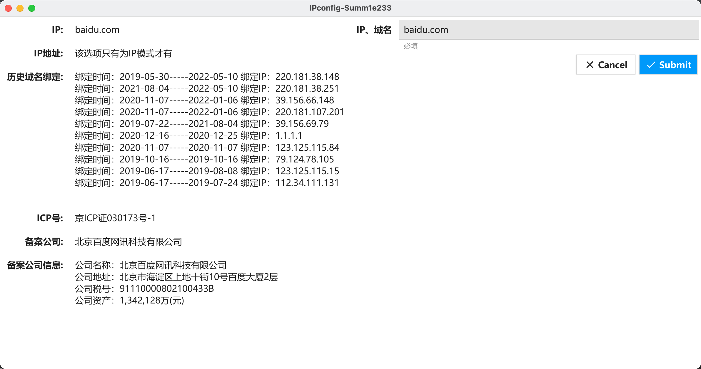
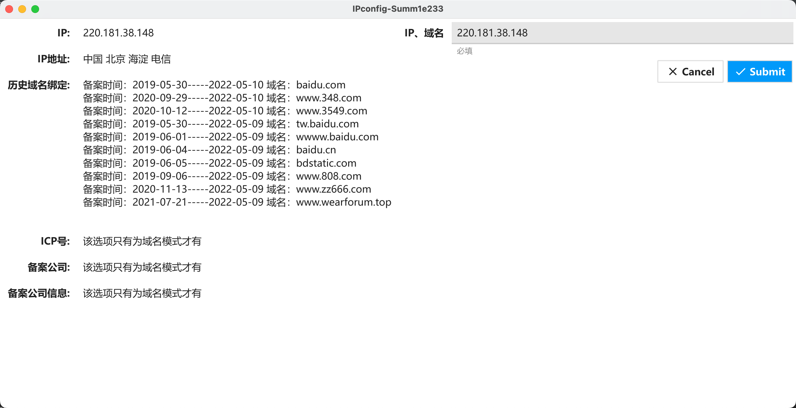
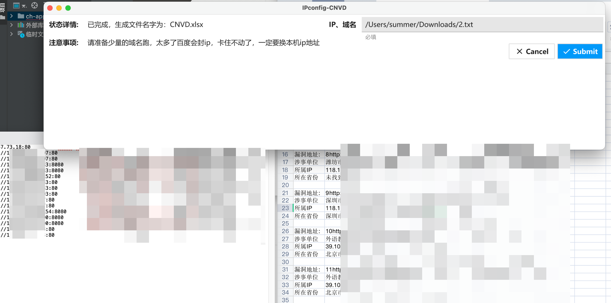

# IPconfig
# 前言

哈喽呀，各位师傅们好，这个工具想必大家都之前使用了一波，因为python安装库的原因，可能就劝退了好多师傅，但是本次,在学习go的时候顺便升级了一下改工具，不用库，就可以快速查询IP 地址 公司信息 名称 地址税号

对此还有bug请老规矩，公众号留言啦

# 效果展示图

首先是清爽的界面

然后就是可以输入域名 比如 baidu.com

或者是向根据IP查询域名 比如 220.181.38.148

目前还是V1版本，后续还需要不断优化，这里当中先透露一个bug版本，就是下面的特供版本，可以识别IP查域名，同时也可以根据域名查询，这个版本目前还未成功调试，只有个别内侧师傅使用，稍后会推出奥

